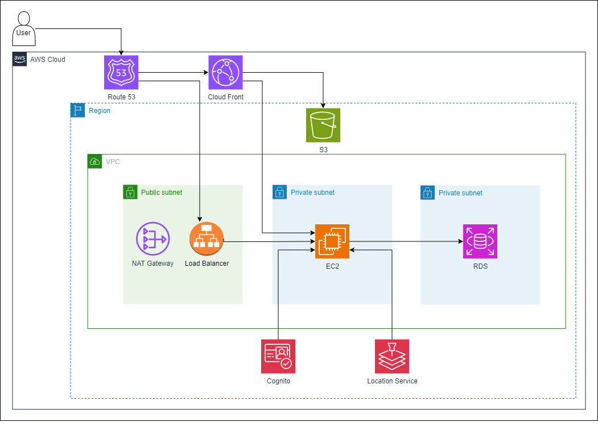

# O.S.A.I
Projeto que integra um aplicativo para usuários e um site para paramédicos, proporcionando um sistema eficiente de solicitação de ambulâncias e compartilhamento de informações médicas vitais em situações de emergência. Nossa missão é oferecer atendimento de emergência rápido, preciso e personalizado, garantindo a segurança e o cuidado dos pacientes enquanto facilitamos a comunicação entre pacientes, familiares e profissionais de saúde.

### **Website**
https://osai.com.br/

# React Native app com serviços da AWS
O aplicativo foi desenvolvido com React Native e integra serviços especializados em localização, além de outras funcionalidades oferecidas pela AWS.

O Aplicativo utiliza:

- [Route 53](https://aws.amazon.com/route53/)
- [CloudFront](https://aws.amazon.com/cloudfront/)
- [Cognito](https://aws.amazon.com/cognito/)
- [AWS EC2](https://aws.amazon.com/ec2/)
- [Amazon S3](https://aws.amazon.com/s3/)
- [AWS RDS](https://aws.amazon.com/rds/)
- [AWS Location Service](https://aws.amazon.com/location/)
- [NAT Gateway](https://aws.amazon.com/vpc/features/nat-gateway/)
- [Load Balancer](https://aws.amazon.com/elasticloadbalancing/)

<!-- O Aplicativo utiliza [AWS RDS](https://aws.amazon.com/rds/) to store all contact info and it uses [AWS SNS](https://aws.amazon.com/sns/) to send SMS notifications. -->

<br>

# Topologia da Infraestrutura
### Target Architecture




<!-- <br>

## Step-by-step

<br>

### **Create Network**

01. Login into AWS Console.

02. On **Services** type **VPC** and select the service.

03. Select **Create VPC** and complete with below parameters.

    - Resources to create : **VPC and more**
    - Auto-generate : **db**
    - IPv4 CIDR block : **30.0.0.0/16**
    - Number of Availability Zones (AZs) : **2**
    - Customize AZs
      - First availability zone : **us-east-1a**
      - Second availability zone : **us-east-1b**
    - Number of public subnets : **2**
    - Number of private subnets : **2**
    - Customize subnets CIDR blocks
      - Public subnet CIDR block in us-east-1a : **30.0.1.0/24**
      - Public subnet CIDR block in us-east-1c : **30.0.3.0/24**
      - Private subnet CIDR block in us-east-1a : **30.0.2.0/24**
      - Private subnet CIDR block in us-east-1c : **30.0.4.0/24**
    - NAT gateways : **None**
    - VPC endpoints : **None**

    <br>

    > **Note** Remain standard values for all other options.
    
04. Click **Create VPC**.

05. Validate if all VPC resources were created.

    > **Note**
    > Check carefully this step prior to proceed. This is step is a requirements for all following steps. In case of questions/issues, don´t proceed, stop and ask for help.
      - Following resources should be created:
        - 1 VPC
        - 4 subnets
        - 1 Internet Gateway
        - 3 routing tables
      
      <br>

    > **Warning**
    > Discard message *Failed to load rule groups*, in case it appears.

<br>    

### **Create Firewall**

<br>

#### **Public Firewall**

01. On **Services** type **VPC** and select the service.

02. In the left side menu click **Security Groups**.

03. Click **Create security group** and complete with below parameters.

    - Security group name : **db-sg-pub**
    - Description         : **DB Security Group public**
    - VPC                 : **db-vpc**
    - Inbound rules (Click **Add rule** for each rule below)
      - Rule 1
        - Type : **All traffic**
        - Source : **30.0.0.0/16**
      - Rule 2
        - Type : **HTTP**
        - Source : **0.0.0.0/0**
      - Rule 3
        - Type : **SSH**
        - Source : **0.0.0.0/0**

    <br>
    
    > **Note** Remain standard values for all other options.

04. Click **Create security group**.

<br>

#### **Private Firewall**

01. On **Services** type **VPC** and select the service.

02. In the left side menu click **Security Groups**.

03. Click **Create security group** and complete with below parameters.

    - Security group name : **db-sg-priv**
    - Description         : **DB Security Group private**
    - VPC                 : **db-vpc**
    - Inbound rules (Click **Add rule**)
      - Type : **All traffic**
      - Source : **30.0.0.0/16**

    <br>
    
    > **Note** Remain standard values for all other options.

04. Click **Create security group**.

<br>

### **Create Database**

01. On **Services** type **RDS** and select the service.

<br>

#### **Create Subnet Group**

01. In the left panel menu click **Subnet groups**.

02. Click **Create DB subnet group** and complete with below parameters.

    - Name : **db-sn-group**
    - Description: **DB Subnet Group**
    - VPC  : **db-vpc**
    - Availability Zones : **us-east-1a** and **us-east-1b**
    - Subnets: **30.0.2.0/24** and **30.0.4.0/24**

    <br>
    
    > **Note** Remain standard values for all other options.

03. Click **Create**.

<br>

#### **Create and Config Parameter Group**

01. In the left panel menu click **Parameter groups**.

02. Click **Create parameter group** and complete with below parameters.

    - Parameter group family : ***mysql8.0**
    - Group name : **db-param-group**
    - Description: **DB Parameter Group**
    - VPC  : **db-vpc**
    - Availability Zones : **us-east-1a** and **us-east-1b**
    - Subnets: **30.0.2.0/24** and **30.0.4.0/24**

    <br>
    
    > **Note** Remain standard values for all other options.

03. Click **Create**.

04. Check the line with the new Parameter Group **db-param-group** and click **Parameter group actions**, **Edit**.

05. In the **Parameters** search field type **character_set_server**.

06. Check the line with parameter **character_set_server** and select **utf8** in the **Values** combo box.

07. Click **Save changes**.

08. In the **Parameters** search field type **character_set_database**.

09. Check the line with parameter **character_set_database** and select **utf8** in the **Values** combo box.

10. Click **Save changes**.

<br>

#### **Create database**

01. In the left panel menu click **Databases**.

02. Click **Create database** and complete with below parameters.

    - Engine options
      - Engine type: **MySQL**
    - Availability and durability
      - Deployment options: **Multi-AZ DB instance**
    - Settings
      - DB instance identifier : **db-instance-id**
      - Master username : **dbadmin**
      - Master password : **dbpassword**
      - Confirm master password : **dbpassword**
    - Instance configuration
      - DB instance class : **Burstable classes (includes t classes)**
    - Storage
      - Storage type : **gp2**
      - Enable storage autoscaling: **disabled**
    - Connectivity
      - Virtual private cloud (VPC) : **db-vpc**
      - Existing VPC security groups : **db-sg-priv**
        > **Note** Remove the **default** security group if selected.
    - Monitoring
      - Enable Enhanced monitoring : **disabled**
    - Additional configuration
      - Initial database name : **dbname**
      - DB parameter group : **db-param-group**
      - Enable automated backups : **disabled**
      - Enable encryption : **disabled**
      - Enable auto minor version upgrade : **disabled**
      - Enable deletion protection : **disabled**

    <br>

    > **Note** Remain standard values for all other options.

03. Click **Create database**.

04. Close screen **Suggested add-ons for database-1** in case it appears.

05. Validate database creation.

    > **Note** 
    > Process should take 10-15 minutes.
    > Wait until status is **Available**.

06. Click on **db-instance-id** and capture the **Endpoint** value. It will be used on later steps.

<br>

### **Create Load Balancer with Autoscaling**

<br>

#### **Create EC2 Launch template**

01. Login into AWS Console.

02. On **Services** type **EC2** and select the service.

03. In the left panel menu, under **Instances**,  click **Launch Templtes**.

04. Select **Create launch template** and complete with below parameters.

    - Launch template name : **ec2-launch-template**
    - Application and OS Images (Amazon Machine Image)
      - Quick start: **Amazon Linux**
      - Amazon Machine Image (AMI) : **Amazon Linux 2 AMI (HVM)**
      - AMI ID : **ami-069aabeee6f53e7bf**
    - Instance type : **t2.micro**
    - Key pair : **vockey** (or any from your choice)
    - Network Settings
      - Security groups : **db-sg-pub**
      - Auto-assign public IP : **Enable**
    - Advanced details
      - User data
      > **Note** Replace **[RDS_ENDPOINT]** with the database endpoint captured in previous steps.
      ```
      #!/bin/bash
      
      echo "Update/Install required OS packages"
      yum update -y
      amazon-linux-extras install -y php7.2 epel
      yum install -y httpd mysql php-mtdowling-jmespath-php php-xml telnet tree git
      
      echo "Config PHP app Connection to Database"
      cat <<EOT >> /var/www/config.php
      <?php
      define('DB_SERVER', '[RDS_ENDPOINT]');
      define('DB_USERNAME', 'dbadmin');
      define('DB_PASSWORD', 'dbpassword');
      define('DB_DATABASE', 'dbname');
      ?>
      EOT
      
      echo "Deploy PHP app"
      cd /tmp
      git clone https://github.com/kledsonhugo/notifier
      cp /tmp/notifier/app/*.php /var/www/html/
      rm -rf /tmp/notifier
      
      echo "Config Apache WebServer"
      usermod -a -G apache ec2-user
      chown -R ec2-user:apache /var/www
      chmod 2775 /var/www
      find /var/www -type d -exec chmod 2775 {} \;
      find /var/www -type f -exec chmod 0664 {} \;
      
      echo "Start Apache WebServer"
      systemctl enable httpd
      service httpd restart
      ```

    <br>

    > **Note** Remain standard values for all other options.
    
05. Click **Create launch template**.

<br>

#### **Create EC2 Auto Scaling Group**

01. In the left panel menu, under **Auto Scaling**,  click **Auto Scaling Groups**.

02. Select **Create Auto Scaling group** and complete with below parameters.

    - Auto Scaling group name : **ec2-auto-scaling-group**
    - Launch template : **ec2-launch-template**

    <br>

    > **Note** Remain standard values for all other options.

03. Click **Next**.

04. Complete with below parameters.

    - VPC : **db-vpc**
    - Availability Zones and subnets : **30.0.1.0/24** and **30.0.3.0/24**

    <br>

    > **Note** Remain standard values for all other options.

05. Click **Next**.

06. Complete with below parameters.

    - Load balancing : **Attach to a new load balancer**
    - Attach to a new load balancer : **ec2-load-balancer**
    - Load balancer scheme : **Internet-facing**
    - Listeners and routing
      - Default routing (forward to) : **Create a target group**
      - New target group name : **ec2-target-group**

    <br>

    > **Note** Remain standard values for all other options.

07. Click **Next**.

08. Complete with below parameters.

    - Group size - optional
      - Desired capacity : **4**
      - Minimum capacity : **2**
      - Maximum capacity : **8**

    <br>

    > **Note** Remain standard values for all other options.

09. Click **Next**.

10. Click **Next** again.

11. Click **Next** last time.

12. Click **Create Auto Scaling group**.

<br>

#### **Validate Target Group**

01. In the left panel menu, under **Load Balancing**, click **Target Groups**.

02. Click on **ec2-target-group** and validate if 4 instances are **Healthy**.

    > **Note** The instance registration process takes 5-10 minutes.

<br>

#### **Validate Load Balancer**

01. In the left panel menu, under **Load Balancing**, click **Load Balancers**.

02. Click on **ec2-load-balancer** and capture the valur for field **DNS name**.

03. Open a browser tab and navigate to the load balancer **DNS name**.

<br>

## **Congratulations**

If you reach this step, you completed successfully the procedure.

Don´t forget to destroy all resources avoiding unnecessary costs. -->
